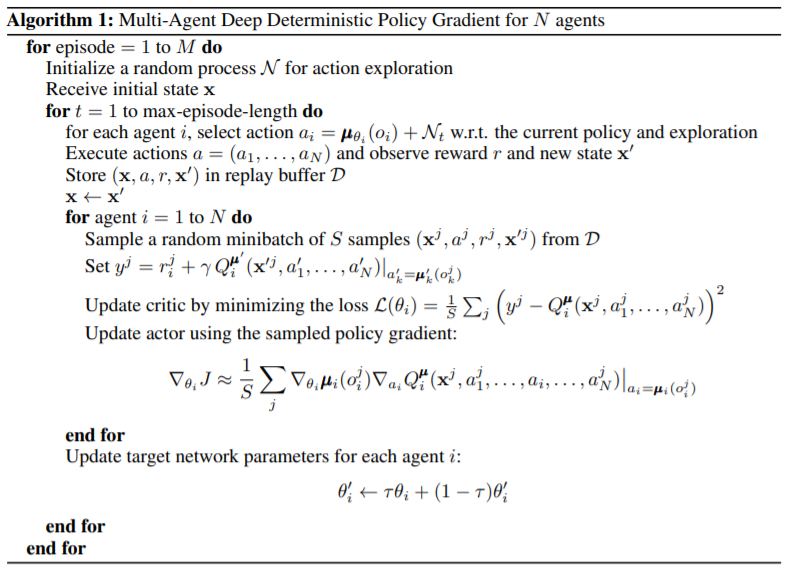
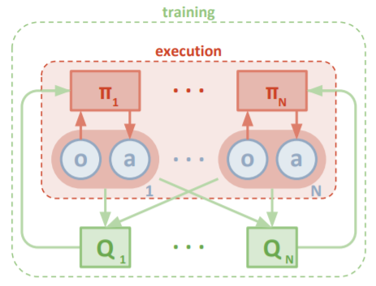
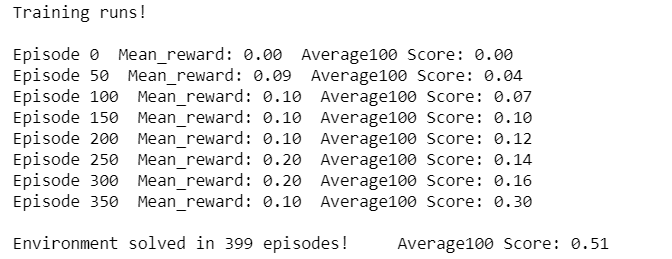
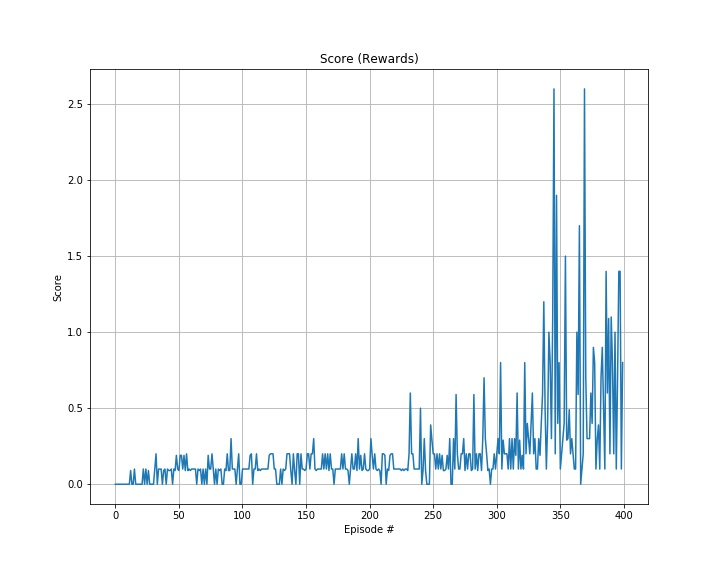

# Report of Udacity Deep Reinforcement Learning Nanodegree Project 3: Collaboration and Competition

This is my report for [Udacity Deep Reinforcement Learning Nanodegree](https://www.udacity.com/course/deep-reinforcement-learning-nanodegree--nd893) Project 3: Collaboration and Competition.

## Project's goal


In this project, two agents control rackets to bounce a ball over a net. If an agent hits the ball over the net, it receives a reward of +0.1. If an agent lets a ball hit the ground or hits the ball out of bounds, it receives a reward of -0.01. Thus, the goal of each agent is to keep the ball in play.

### Environment details

The environment is based on [Unity ML-agents](https://github.com/Unity-Technologies/ml-agents). Unity ML-Agents is an open-source Unity plugin that enables games and simulations to serve as environments for training intelligent agents.

**Note:** The Unity ML-Agent team frequently releases updated versions of their environment. We are using the v0.4 interface. The project environment provided by Udacity is similar to, but not identical to the [TennisEnv](https://github.com/Unity-Technologies/ml-agents/blob/master/docs/Learning-Environment-Examples.md#tennis) environment on the Unity ML-Agents GitHub page.

The observation space consists of 8 variables corresponding to the position and velocity of the ball and racket. Each agent receives its own, local observation. Two continuous actions are available, corresponding to movement toward (or away from) the net, and jumping.

### Solving the Environment

The task is episodic, and in order to solve the environment, **the agents must get an average score of +0.5 (over 100 consecutive episodes, after taking the maximum over both agents)**. Specifically,

- After each episode, we add up the rewards that each agent received (without discounting), to get a score for each agent. This yields 2 (potentially different) scores. We then take the maximum of these 2 scores.
- This yields a single score for each episode.

The environment is considered solved, **when the average (over 100 episodes) of those scores is at least +0.5**.


## Agent Implementation

### Multi-Agent Deep Deterministic Policy Gradient (MADDPG)

In this project I used a multi-agent algorithm called **Multi Agent Deep Deterministic Policy Gradient (MADDPG)** which is described in the paper [Multi-Agent Actor-Critic for Mixed Cooperative-Competitive Environments](https://arxiv.org/abs/1706.02275).
> **Abstract**: We explore deep reinforcement learning methods for multi-agent domains. We begin by analyzing the difficulty of traditional algorithms in the multi-agent case: Q-learning is challenged by an inherent non-stationarity of the environment, while policy gradient suffers from a variance that increases as the number of agents grows. We then present an adaptation of actor-critic methods that considers action policies of other agents and is able to successfully learn policies that require complex multi-agent coordination. Additionally, we introduce a training regimen utilizing an ensemble of policies for each agent that leads to more robust multi-agent policies. We show the strength of our approach compared to existing methods in cooperative as well as competitive scenarios, where agent populations are able to discover various physical and informational coordination strategies.



This algorithm is taken from [MADDPG paper](https://arxiv.org/pdf/1706.02275.pdf).



This overview graph of the multi-agent decentralized actor, centralized critic approach is taken from [MADDPG paper](https://arxiv.org/pdf/1706.02275.pdf).

In a word, during the execution time, each actor has access to only its agent's observation and actions. During the training, the critic networks have access to the observation and actions of all agents. Learning critic for each agent allows us to use a different reward structure for each. Hence, the algorithm can be used in all, cooperative, competitive and mixed scenarios.

### Code implementation

The codes consist of 2 files:

- `model.py` : Implement the **Actor** and the **Critic** class.
    - Both Actor and Critic class implement a *Target* and a *Local* Neural Network for training.
    
- `Tennis.ipynb` : 
    - Import the necessary packages 
    - Check the state and action spaces
    - The Actor's *Local* and *Target* neural networks, and the Critic's *Local* and *Target* neural networks, the Noise process and the Replay Buffer are instanciated by the DDPG Agent.
    - The Noise uses Ornstein-Uhlenbeck process.
    - The Replay Buffer is a fixed-size buffer to store experience tuples.
    - Create MADDPG class
    - Train 2 agents using MADDPG
    - Plot the scores/rewards
  
### Hyperparameters

The MADDPG agent uses the following hyperparameters:

```
BUFFER_SIZE = int(1e6)  # replay buffer size
BATCH_SIZE = 256        # minibatch size
GAMMA = 0.99            # discount factor
TAU = 1e-3              # for soft update of target parameters
LR_ACTOR = 1e-3         # learning rate of the actor 
LR_CRITIC = 1e-3        # learning rate of the critic
WEIGHT_DECAY = 0        # L2 weight decay
LEARN_EVERY = 1         # update the networks 3 times after every timestep
LEARN_NUMBER = 3        # update the networks 3 times after every timestep
EPSILON = 1.0           # noise factor
EPSILON_DECAY = 0.99    # noise factor decay
CLIPGRAD = .1           # clip gradient parameter
seed = 10               # random seed
```

The **Actor Neural Networks** use the following architecture :

```
Input Layer (3*8=24) ->
Fully Connected Hidden Layer (450 nodes, Batch Normlization, relu activation) ->
Fully Connected Hidden Layer (350 nodes, Batch Normlization, relu activation) ->
Ouput Layer (2 nodes, tanh activation)
```


The **Critic Neural Networks** use the following architecture :

```
Input Layer (24) ->
Fully Connected Hidden Layer (256+2 nodes [including actions], Batch Normlization, relu activation) ->
Fully Connected Hidden Layer (128 nodes, Batch Normlization, relu activation) ->
Ouput Layer (1 node, no activation)
```

Some important changes:

- I add noise decay factor *EPSILON_DECAY* for the noise factor *EPSILON*.
- I use gradient clipping when training the critic network `clip_grad_norm_(self.critic.parameters(), self.clipgrad)`.
- I update the actor and critic networks 3 times after every timestep.

## Results

With all these hyperparameters and Neural Networks, the result is quite good:





**The result satisfies the goal of this project as the average (over 100 episodes) of those scores is at least +0.5, and in 399 episodes only**. 
  
## Ideas for future work

Firstly, we can implement [Twin Delayed DDPG (TD3)](https://spinningup.openai.com/en/latest/algorithms/td3.html) or [Soft Actor-Critic (SAC)](https://spinningup.openai.com/en/latest/algorithms/sac.html) for this multi-agent environment in order to improve the performance of agents.

Secondly, in order to further improve this multi-agent performance we can implement [Prioritized Experience Replay](https://arxiv.org/abs/1511.05952).

> **Abstract**: Experience replay lets online reinforcement learning agents remember and reuse experiences from the past. In prior work, experience transitions were uniformly sampled from a replay memory. However, this approach simply replays transitions at the same frequency that they were originally experienced, regardless of their significance. In this paper we develop a framework for prioritizing experience, so as to replay important transitions more frequently, and therefore learn more efficiently. We use prioritized experience replay in Deep Q-Networks (DQN), a reinforcement learning algorithm that achieved human-level performance across many Atari games. DQN with prioritized experience replay achieves a new state-of-the-art, outperforming DQN with uniform replay on 41 out of 49 games.

Finally, we can try to implement different algorithm for different agent and make a match for these two agents to see which algorithm performs better.
